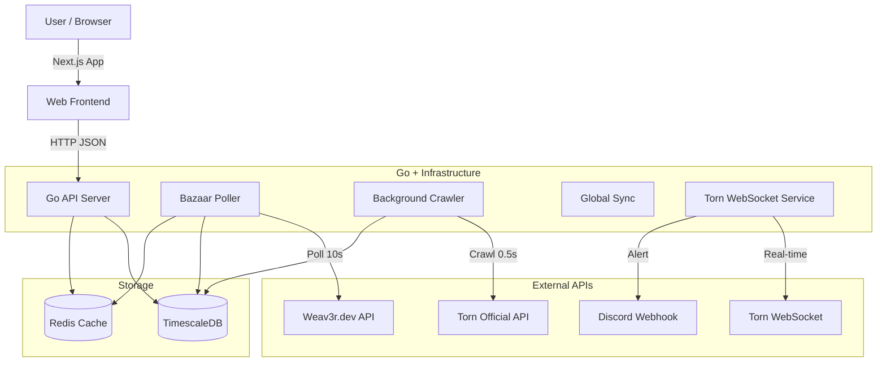

# Torn Market Chart 📈


A high-performance, real-time market tracking and visualization tool for **Torn City**.  
Built with **Go** and **Next.js**, designed to handle high-frequency data updates and provide **TradingView-quality charts**.

---

## ✨ Features

### 🚀 High-Performance Data Collection
- **Real-time WebSocket**: Connects to Torn's `wss://ws-centrifugo.torn.com` to receive trade updates instantly (sub-second latency).
- **Hybrid Polling**:
  - **Bazaar Poller**: Checks watched items every **10 seconds** using `weav3r.dev` API.
  - **Background Crawler**: Rotates through **all 1,200+ items** in the background (0.5s interval) to build a complete price history.
- **Concurrency**: Written in Go to handle hundreds of concurrent requests efficiently.

### 📊 Advanced Visualization
- **TradingView-Style Charts**: Built with `lightweight-charts`. Supports Area, Line, and Candlestick (planned) series.
- **Live Order Book**: Displays the top 5 cheapest listings from both **Item Market** and **Bazaar** side-by-side.
- **Crosshair Tooltip**: Inspect precise Time, Market Price, Bazaar Price, and Moving Averages simultaneously.

### 🔔 Smart Alerting
- **Discord Notifications**: Sends rich Embed messages to your Discord server via Webhook.
- **Complex Triggers**:
  - "Price Below X" / "Price Above Y"
  - **Deduplication**: Intelligent filtering prevents spamming the same price multiple times.
  - **Cooldown**: Configurable silence periods after triggering.

### 🛡️ Reliability & Scale
- **Rate Limiting**: Redis-backed sliding window limiter ensures compliance with API rules (e.g., 100/min).
- **API Key Rotation**: Automatically rotates through multiple API keys to maximize throughput.
- **TimescaleDB**: Optimizes storage for millions of price data points using hyper-tables and compression.

---

## 🏗️ Architecture



---

## 🛠️ Tech Stack

| Category     | Technology      | Description                                           |
| :----------- | :-------------- | :---------------------------------------------------- |
| **Backend**  | **Go (Golang)** | Main server logic, Workers, Chi Router, pgx driver.   |
| **Frontend** | **Next.js 14**  | React framework (App Router), ShadcnUI, TailwindCSS.  |
| **Database** | **TimescaleDB** | PostgreSQL extension for high-speed time-series data. |
| **Cache**    | **Redis**       | Rate limiting, API Key management, Hot caching.       |
| **Infra**    | **Docker**      | Full stack containerization (Compose).                |

---

## 🚀 Getting Started

### Prerequisites
- **Docker** & **Docker Compose**
- **Torn API Key** (Public/Custom)

### Installation (Docker - Recommended)

1. **Clone the repository**
   ```bash
   git clone https://github.com/your-repo/torn-market-chart.git
   cd torn-market-chart
   ```

2. **Configure Environment**
   Copy `.env.example` to `.env` and fill in your details.
   ```bash
   cp .env.example .env
   # Edit .env with your DB credentials & API Keys
   ```

3. **Start Services**
   ```bash
   # Mode A: Internal DB (Easiest)
   docker-compose --profile internal up -d --build
   ```
   
4. **Access the Dashboard**
   Open [http://localhost:3000](http://localhost:3000) in your browser.

---

## 🔧 Configuration (.env)

| Variable                    | Description                         | Default                  |
| :-------------------------- | :---------------------------------- | :----------------------- |
| `DB_DSN`                    | PostgreSQL Connection String        | `postgres://...`         |
| `REDIS_URL`                 | Redis Connection String             | `redis://localhost:6379` |
| `TORN_API_KEY`              | Fallback API Key                    | `""`                     |
| `DISCORD_WEBHOOK_URL`       | Alert notification URL              | `""`                     |
| `BAZAAR_RATE_LIMIT`         | Requests per minute for Weav3r      | `1800`                   |
| `BACKGROUND_CRAWL_INTERVAL` | Interval between background fetches | `500ms`                  |

---

## ☁️ Deployment

For detailed instructions on deploying with Cloudflare Tunnel (no port forwarding required), please see [DEPLOYMENT_JP.md](./DEPLOYMENT_JP.md) (Japanese).

---


## 💻 Development

### Run Locally (Without Docker)

**1. Start Databases**
Ensure PostgreSQL (TimescaleDB) and Redis are running.
```bash
docker-compose up -d db redis
```

**2. Start Backend (Go)**
```bash
cd server
go mod download

# Run API Server
go run ./cmd/api

# Run Background Workers (in new terminal)
go run ./cmd/workers
```

**3. Start Frontend (Next.js)**
```bash
cd web
npm install
npm run dev
```

---

## 📜 License

This project is licensed under the **MIT License**.
