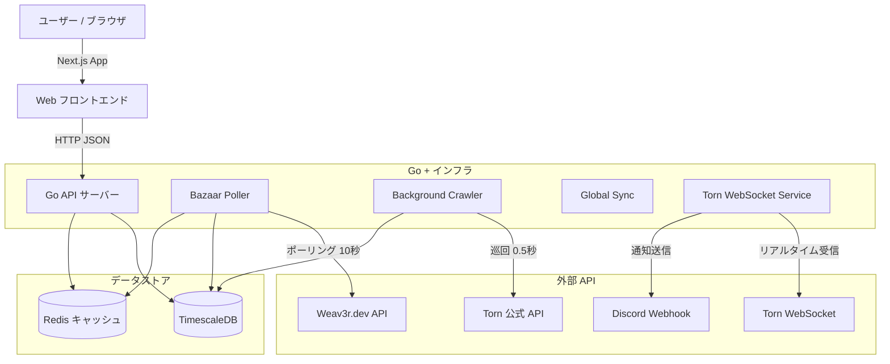

# Torn Market Chart 📈


**Torn City** プレイヤーのための、高性能かつリアルタイムな市場追跡・可視化ツールです。  
**Go** と **Next.js** で構築されており、数百個のアイテムの高速監視と **TradingViewライクなチャート** 表示を実現します。

---

## ✨ 主な機能

### 🚀 高速データ収集・監視
- **リアルタイム WebSocket**: 公式サーバー (`wss://ws-centrifugo.torn.com`) に直結し、トレード発生と同時に更新を検知します（サブ秒レイテンシ）。
- **ハイブリッド・ポーリング**:
  - **Bazaar Poller**: 監視リストのアイテムを **10秒ごと** に `weav3r.dev` API経由でチェックします。
  - **Background Crawler**: 監視外の全アイテム（1,200個以上）をバックグラウンドで **0.5秒間隔** で巡回し、市場全体のデータを蓄積します。
- **高並行処理**: Go言語による並列処理で、大量のリクエストを効率的にさばきます。

### 📊 高度な可視化 (Visualization)
- **TradingViewスタイル・チャート**: `lightweight-charts` を採用。エリアチャート、ラインチャート、移動平均線を表示可能。
- **リアルタイム板情報 (Order Book)**: **アイテムマーケット** と **バザール** の最安値トップ5を横並びでリアルタイム表示します。
- **クロスヘア・ツール**: チャート上のカーソル位置に合わせて、Market価格 / Bazaar価格 / 移動平均線 などの詳細データを瞬時に表示。

### 🔔 スマート通知機能
- **Discord通知**: 設定した条件（価格下落など）を満たすと、リッチなEmbedメッセージをWebhook送信します。
- **高度なトリガー設定**:
  - 「価格が Xドル 以下になったら」 / 「Yドル 以上になったら」
  - **重複排除**: 同じ価格での連続通知を防ぐインテリジェントなフィルターを搭載。
  - **クールダウン**: 一度通知した後、一定時間は通知を抑制する設定が可能。

### 🛡️ 信頼性とスケーラビリティ
- **レート制限**: Redisを使用したスライディングウィンドウ方式で、API制限（例: 100回/分）を厳密に遵守します。
- **APIキーローテーション**: 複数のAPIキーを登録することで、リクエスト容量を自動的にスケールアップします。
- **TimescaleDB**: PostgreSQLの時系列拡張を使用し、数百万件の価格データを効率的に格納・圧縮します。

---

## 🏗️ アーキテクチャ



---

## 🛠️ 技術スタック

| カテゴリ     | 技術            | 説明                                                      |
| :----------- | :-------------- | :-------------------------------------------------------- |
| **Backend**  | **Go (Golang)** | メインサーバーロジック, ワーカー, Chi Router, pgx driver. |
| **Frontend** | **Next.js 14**  | Reactフレームワーク (App Router), ShadcnUI, TailwindCSS.  |
| **Database** | **TimescaleDB** | PostgreSQLベースの時系列データベース.                     |
| **Cache**    | **Redis**       | レート制限, APIキー状態管理, ホットキャッシュ.            |
| **Infra**    | **Docker**      | Docker Composeによる完全コンテナ化.                       |

---

## 🚀 導入方法 (Getting Started)

### 必要要件
- **Docker** および **Docker Compose**
- **Torn API Key** (Public Keyで可)

### インストール (Docker推奨)

1. **リポジトリのクローン**
   ```bash
   git clone https://github.com/your-repo/torn-market-chart.git
   cd torn-market-chart
   ```

2. **環境変数の設定**
   `.env.example` をコピーして `.env` を作成し、中身を編集します。
   ```bash
   cp server/.env.example server/.env
   # server/.env を開き、DBパスワードやAPIキーを設定してください
   ```

3. **サービスの起動**
   ```bash
   # モード A: 内部データベースを使用 (簡単・推奨)
   docker-compose --profile internal up -d --build
   ```
   
4. **ダッシュボードへのアクセス**
   ブラウザで [http://localhost:3000](http://localhost:3000) を開いてください。

---

## 🔧 設定項目 (.env)

| 変数名                      | 説明                     | デフォルト値             |
| :-------------------------- | :----------------------- | :----------------------- |
| `DB_DSN`                    | PostgreSQL 接続文字列    | `postgres://...`         |
| `REDIS_URL`                 | Redis 接続文字列         | `redis://localhost:6379` |
| `TORN_API_KEY`              | フォールバック用 APIキー | `""`                     |
| `DISCORD_WEBHOOK_URL`       | 通知用 Webhook URL       | `""`                     |
| `BAZAAR_RATE_LIMIT`         | Weav3r API 制限 (回/分)  | `1800`                   |
| `BACKGROUND_CRAWL_INTERVAL` | バックグラウンド巡回間隔 | `500ms`                  |

---

## 💻 ローカル開発 (Dockerなし)

**1. データベースの起動**
PostgreSQL (TimescaleDB) と Redis が起動している必要があります。
```bash
docker-compose up -d db redis
```

**2. バックエンド (Go) の起動**
```bash
cd server
go mod download

# APIサーバー
go run ./cmd/api

# ワーカー (別ターミナルで実行)
go run ./cmd/workers
```

**3. フロントエンド (Next.js) の起動**
```bash
cd web
npm install
npm run dev
```

---

## 📜 ライセンス

本プロジェクトは **MIT License** の下で公開されています。
